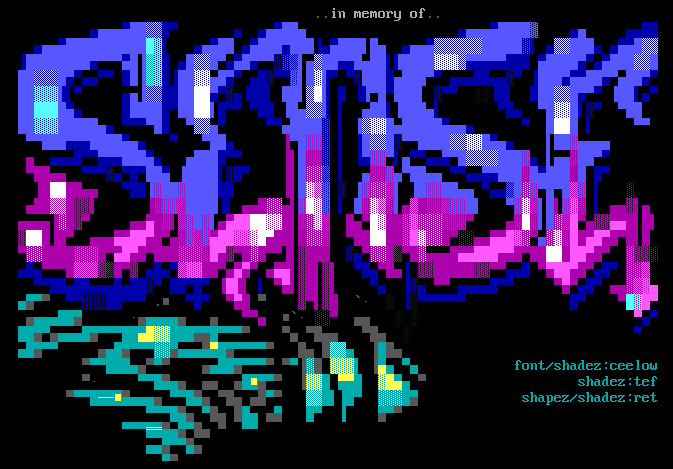
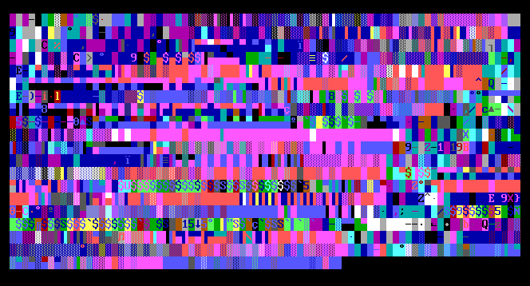

# ANSI

## Table of Contents
- [Idea](#idea)
- [Features](#features)

## Idea

I love the edgy ansi art style from the 90s. 
There are about 50000 art-pieces that can be downloaded from 
16colo.rs and it provides a fun playground for art generation experiments. 
It is especially interesting, because it consists of text on the level of characters,
but it also contains text on the level of graffiti-like stylized BBS names. 
And it contains other elements like faces, figures, abstract ornaments, etc.
Also, converting the data from ANS to something else is a cute little task in itself.

For this reason I wanted to apply the relatively novel vision 
transformers architecture on this problem to iteratively generate 
new and new rows, generating what is known as a scroller.

The results were mixed, I see results. At the same time I have had to reduce 
the number of parameters to a bare minimum to get even remotely 
reasonable epoch times on my laptop. 

## Features

- Ansi miner - this scrapes the 16colo.rs web for ansi files, including metadata.
- AnsToNumConverter - a converter from *.ANS to a translator of your choice. 
- AnsFromNumConverter - inverse conversion from a numeric representation back to ANSI format.
- Transformer model training
- Transformer model sampling

